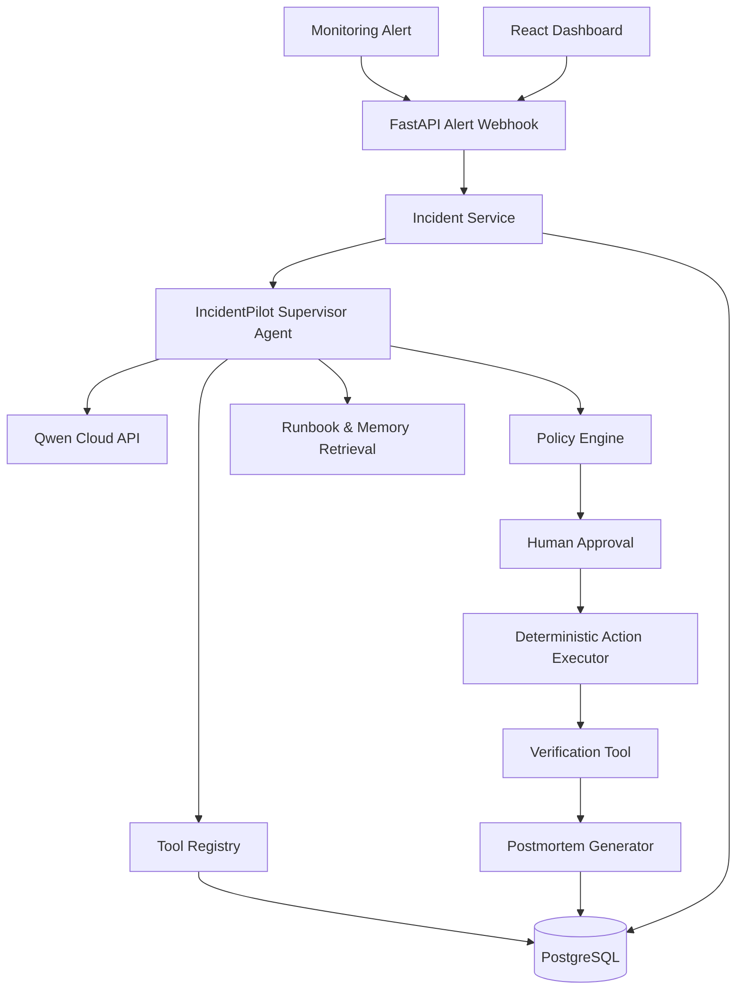

# IncidentPilot Architecture

## Safety Model

- LLM proposes actions.
- Deterministic executor performs actions.
- Production remediation requires approval.
- Tool calls and actions are audited.
- Dangerous/destructive actions are forbidden.
